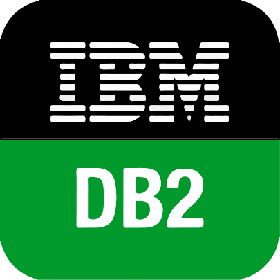
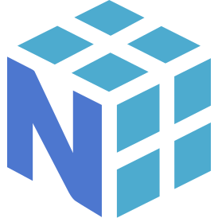

# Software Engineer
Hey there! If you would like to learn more about me, check out my [portfolio](https://erolgelbul.com).

## Goals for 2023
* Contribute to tinygrad.
* Finish F1 project.
* Flight dynamics.

## Education

* University of Hertfordshire
  * BSc Computer Science - First Class 4/4
* Tarsus American College
  * Dual Diploma - 80/100

## Papers

* Flight Path Optimisation - 2021 [View](https://github.com/ErolGelbul/flight_path_optimisation) | [Download](https://drive.google.com/uc?export=download&id=1VK_rEmZJwPXao4yiDcjorkwUDwh60QAO)
* Computing OBDDs - ONG
* Aloe Vera Modelling - 2017 [Download](https://drive.google.com/uc?export=download&id=18VCWm5miUQJ5SFZ06rLlY7nB7DBAvRoQ)

### Links:

&nbsp;&nbsp;

&nbsp;&nbsp;

<b>Utilities</b>

### 09/04/2023:

# Project Explorer

Click on the icons below to discover my relevant projects.

 
<h2 align="left" id="macropower-tech">Language Experience</h2>
<table>
  <tr>
    <td align="center" width="96">
      
       Python
    </td>
    <td align="center" width="96">
      
       C++
    </td>
    <td align="center" width="96">
      
       C#
    </td>
    <td align="center" width="96">
      
       C/Embedded
    </td>
    <td align="center" width="96">
      
       Javascript
    </td>
    <td align="center" width="96">
      
       Java
    </td>
    <td align="center" width="96">
      
       MATLAB
    </td>
    <td align="center" width="96">
      
       Assembly
    </td>
    <td align="center" width="96">
      
       LaTeX
    </td>
  </tr>
</table>

<h2 align="left" id="macropower-tech">Web Development Experience</h2>
<table>
  <tr>
    <td align="center" width="96">
      
       Django
    </td>
    <td align="center" width="96">
      
       Flask
    </td>
    <td align="center" width="96">
      
       PHP
    </td>
    <td align="center" width="96">
      
       FastAPI
    </td>
    <td align="center" width="96">
      
       Express.js
    </td>
    <td align="center" width="96">
      
       Node.js
    </td>
    <td align="center" width="96">
      
       React
    </td>
    <td align="center" width="96">
      
       HTML
    </td>
    <td align="center" width="96">
      
       Tailwind CSS
    </td>
  </tr>
</table>

<h2 align="left" id="macropower-tech">Database Experience</h2>
<table>
  <tr>
    <td align="center" width="96">
      
       PostgreSQL
    </td>
    <td align="center" width="96">
      
       MySQL
    </td>
    <td align="center" width="96">
      
       Microsoft SQL
    </td>
    <td align="center" width="96">
      
       SQLite
    </td>
    <td align="center" width="96">
      
       Oracle SQL
    </td>
    <td align="center" width="96">
      
       DB2
    </td>
    <td align="center" width="96">
      
       MongoDB
    </td>
  </tr>
</table>

<h2 align="left" id="macropower-tech">Data Science Experience</h2>
<table>
  <tr>
    <td align="center" width="96">
      
       NumPy
    </td>
    <td align="center" width="96">
      
       pandas
    </td>
    <td align="center" width="96">
      
       plotly
    </td>
    <td align="center" width="96">
      
       Dash
    </td>
    <td align="center" width="96">
      
       seaborn
    </td>
    <td align="center" width="96">
      
       matplotlib
    </td>
    <td align="center" width="96">
      
       folium
    </td>
    <td align="center" width="96">
      
       SciPy
    </td>
    <td align="center" width="96">
      
       Scikit-learn
    </td>
  </tr>
</table>

<h2 align="left" id="macropower-tech">Powered By</h2>
<table>
  <tr>
    <td align="center" width="96"> 
      
       GPT-4
    </td>
    <td align="center" width="96">
      
       Copilot
    </td>
    <td align="center"  width="96">
      
       vim
    </td>
    <td align="center"  width="96">
      
       VS Code 
    </td>
    <td align="center" width="96">
      
       Bash
    </td>
  </tr>
</table>

 
 

[website]: https://erolgelbul.com
[youtube]: https://youtube.com/erolgelbul

